<PageTitleHeader section="calling native C APIs"/>

# calling <UniqueTechnicalTerm val="native C APIs"/>

```c
std::cout<<"Hello World !"<<std::endl;
```

---

<PageTitleHeader section="calling native C APIs" title="Use Case"/>

## Use Case

C based libraries we want to use is often highly optimized and difficult to replace.  
A few examples include the use of [realm](https://github.com/realm/realm-core) and [opencv](https://opencv.org/).

---
layout: two-cols
---
<!-- https://github.com/slidevjs/slidev/blob/main/packages/client/layouts/two-cols.vue -->

<PageTitleHeader section="calling native C APIs" title="Journey Overview"/>

## Journey Overview

```mermaid {scale: 0.6}
journey
    section In the beginning
        via「Platform Channels」: 3
    section Big impact of performance
        with「dart#58;ffi」 : 6
    section Impact of glue code
        +「ffigen」 : 7
```


<!-- https://mermaid-js.github.io/mermaid/#/./flowchart?id=entity-codes-to-escape-characters -->

::right::
<br/>
<br/>
<br/>
<br/>
<div style="margin-left: 5em; font-size: xx-small">
    <div>
        [supplement]
        <br/>
        <TechnicalTerm val="dart:ffi"/> Architecture Overview
        (ref: <a href="https://github.com/dart-lang/sdk/blob/master/samples/ffi/sqlite/docs/sqlite-tutorial.md#architecture-overview">dart-lang/sdk docs</a>)
    </div>
    <br/>
    
</div>

---

<PageTitleHeader section="calling native C APIs" title="Issues"/>

## Performance Issue in the beginning

We had to use <a href="https://docs.flutter.dev/development/platform-integration/platform-channels" target="_blank"><TechnicalTerm val="Platform Channels"/></a> to call <UniqueTechnicalTerm val="native C APIs"/> with a lot of glue code.  
<!-- [Dart VM FFI Vision written by Google dart-lang Team Engineer](https://gist.github.com/mraleph/2582b57737711da40262fad71215d62e) -->

There is an **overhead** to call <UniqueTechnicalTerm val="native C APIs"/> **via** <TechnicalTerm val="Platform Channels"/>.  
This is especially noticeable on Android.


<em>Calling into Java with JNI versus executing the equivalent in C is ~20x slower</em>. ([ref](https://docs.google.com/document/d/1bD_tiN987fWEPtw7tjXHzqZVg_g9H95IS32Cm609VZ8))

---

<PageTitleHeader section="calling native C APIs" title="Issues"/>

### How about executing from another isolate?

We can't do that yet.

### How about executing channel handlers on background?

Unfortunately, not enough.  

● [Executing channel handlers on background threads](https://docs.flutter.dev/development/platform-integration/platform-channels#channels-and-platform-threading) isn't supported except for iOS and Android.  
　macOS/Windows/Linux 😢

● In the first place, our ideal here is calling <UniqueTechnicalTerm val="native C APIs"/> **directly** **in background**.

---

<PageTitleHeader section="calling native C APIs" title="Impact"/>

## Performance Impact by <TechnicalTerm val="dart:ffi"/>

We don't have to use <TechnicalTerm val="Platform Channels"/> because we can use <TechnicalTerm val="dart:ffi"/> to call <UniqueTechnicalTerm val="native C APIs"/> **directly**.  
Moreover, we can do that in another **spawned isolate**.  

example: serve isolate calls native C APIs. <small>(ref: [sensuikan1973/pedax](https://github.com/sensuikan1973/pedax/blob/main/lib/engine/edax_server.dart))</small>
<!-- FFI package example: https://github.com/sensuikan1973/libedax4dart -->


<!-- https://mermaid-js.github.io/mermaid/#/flowchart -->
