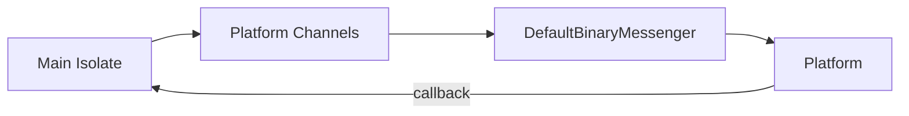
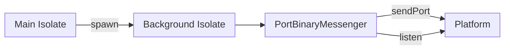

<PageTitleHeader section="calling platform-specific APIs"/>

# calling <UniqueTechnicalTerm val="platform-specific APIs"/>

```swift
// macos example
// security-scoped bookmarks
URL(fileURLWithPath: "/path/to/xxx").bookmarkData(~)
```

---

<PageTitleHeader section="calling platform-specific APIs" title="Use Case"/>

## Use Case

As the term implies, it is used to call <UniqueTechnicalTerm val="platform-specific APIs"/>.  
A few examples include the use of [security-scoped bookmarks](https://pub.dev/packages/macos_secure_bookmarks) and [path_provider](https://pub.dev/packages/path_provider).

<div style="margin-left: 5em; font-size: xx-small">
    <div>
        [supplement] <TechnicalTerm val="Platform Channels"/> Architectural overview
        <br/>
        (<a href="https://docs.flutter.dev/development/platform-integration/platform-channels#architecture" target="_blank">https://docs.flutter.dev/development/platform-integration/platform-channels#architecture</a>)
    </div>
</div>


---
layout: two-cols
---
<!-- https://github.com/slidevjs/slidev/blob/main/packages/client/layouts/two-cols.vue -->

<PageTitleHeader section="calling platform-specific APIs" title="Journey Overview"/>

## Journey Overview

```mermaid {scale: 0.6}
journey
    section In the beginning
        with「Platform Channels」: 3
    section Impact of glue code
        +「Pigeon」: 4
    section workaround for performance
        +「3rd package flutter_isolate」 : 4
    section Big impact of performance
        +「Isolate Platform Channels」 : 7
```


<!-- https://docs.flutter.dev/development/platform-integration/platform-channels#pigeon -->

::right::
<br/>
<br/>
<br/>
<br/>
<div style="margin-left: 5em; font-size: xx-small">
    <div>
    <!-- [supplement] aaa -->
    </div>
</div>

---

<PageTitleHeader section="calling platform-specific APIs" title="Issues"/>

## Current Performance Issue

It's heavy to call <UniqueTerm val="Expensive"/> <UniqueTechnicalTerm val="platform-specific APIs"/> because <TechnicalTerm val="Platform Channels"/> can't be used from _not_ main isolate.

[Executing channel handlers on background threads](https://docs.flutter.dev/development/platform-integration/platform-channels#channels-and-platform-threading) isn't supported except for iOS and Android.  
macOS/Windows/Linux 😢


<!-- https://github.com/flutter/flutter/blob/bbdf617034171ab1128a594fb24e1c72a09e072e/packages/flutter/lib/src/services/binding.dart#L82 -->
<!-- https://api.flutter.dev/flutter/services/BinaryMessenger-class.html -->
<!-- https://api.flutter.dev/flutter/services/ServicesBinding/defaultBinaryMessenger.html -->

---

<PageTitleHeader section="calling platform-specific APIs" title="Impact"/>

## Performance Impact by <TechnicalTerm val="Isolate Platform Channels"/>

We can call <UniqueTerm val="Expensive"/> <UniqueTechnicalTerm val="platform-specific APIs"/> in background threads because we can **spawn isolate**.
(※ available on master channel at 2022/10/14)

```dart
// example
Future<void> main() async => Isolate.spawn(_executeExpensivePlatformAPIs, RootIsolateToken.instance!);
Future<void> _executeExpensivePlatformAPIs(RootIsolateToken rootIsolateToken) async {
    BackgroundIsolateBinaryMessenger.ensureInitialized(rootIsolateToken);
    SharedPreferences sharedPreferences = await SharedPreferences.getInstance();
}
```
<!-- https://github.com/flutter/website/blob/40204477a6bddc83c1aae7684b8d2db9563265a4/src/development/platform-integration/platform-channels.md#using-plugins-and-channels-from-background-isolates -->


<!-- https://docs.google.com/document/d/1yAFw-6kBefuurXWTur9jdEUAckWiWJVukP1Iay8ehyU -->
<!-- https://api.dart.dev/stable/2.18.3/dart-isolate/SendPort-class.html -->
