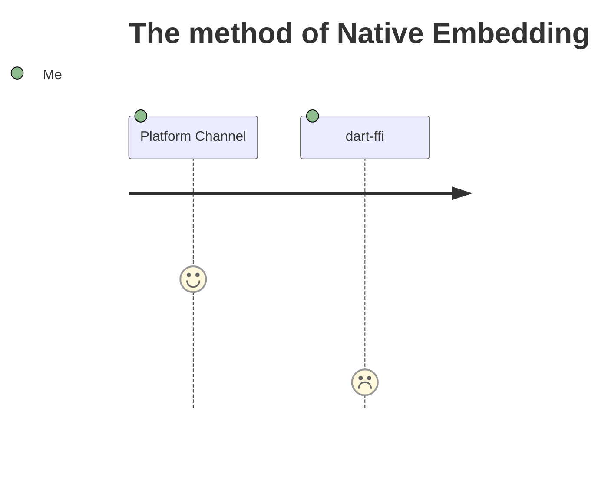

<PageTitleHeader title="Introduction 1 / 3"/>

## What is **_Expensive_** here ?

Operations require a lot of CPU, Memory and Running Time.  
e.g. Connection to remote server, Huge Numerical computation, ...

## What is **_Native_** here ?

- ① C APIs on Android/iOS/macOS
- ② platform-specific APIs   <small>(Kotlin/Java on Android, Swift/Objective-C on iOS, C++ on Windows, Objective-C on macOS, C on Linux)</small>

<!--
https://docs.flutter.dev/development/platform-integration/platform-channels

https://docs.flutter.dev/development/platform-integration/android/c-interop
https://docs.flutter.dev/development/platform-integration/ios/c-interop
https://docs.flutter.dev/development/platform-integration/macos/c-interop
-->

---

<PageTitleHeader title="Introduction 3 / 3"/>

# Journey

