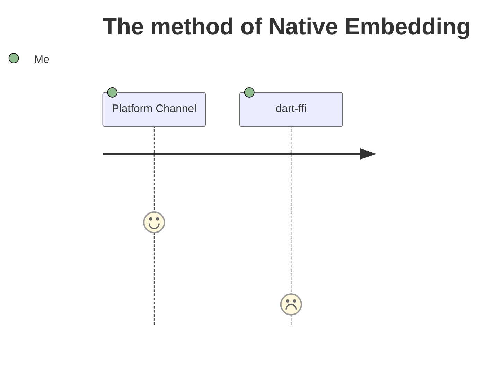

<PageTitleHeader section="Introduction" title="Term Definition"/>

## What is **_Expensive_** here ?

Operations require a lot of CPU, Memory and Running Time.  
e.g. Connection to remote server, Huge Numerical computation, ...

## What is **_Native_** here ?

- ① <Term val="native C APIs"/>   <small>on **Android/iOS/macOS**</small>
- ② <Term val="platform-specific APIs"/>   <small>(Kotlin/Java on Android, Swift/Objective-C on iOS, C++ on Windows, Objective-C on macOS, C on Linux)</small>

<!--
https://docs.flutter.dev/development/platform-integration/platform-channels

https://docs.flutter.dev/development/platform-integration/android/c-interop
https://docs.flutter.dev/development/platform-integration/ios/c-interop
https://docs.flutter.dev/development/platform-integration/macos/c-interop
-->

---

<PageTitleHeader section="Introduction" title="Use Case"/>

## Use Case of <Term val="native C APIs"/>

aa

---

<PageTitleHeader section="Introduction" title="Use Case"/>

## Use Case of <Term val="platform-specific APIs"/>

aa

---

<PageTitleHeader section="Introduction 3" title="Journey Overview"/>

# Journey

