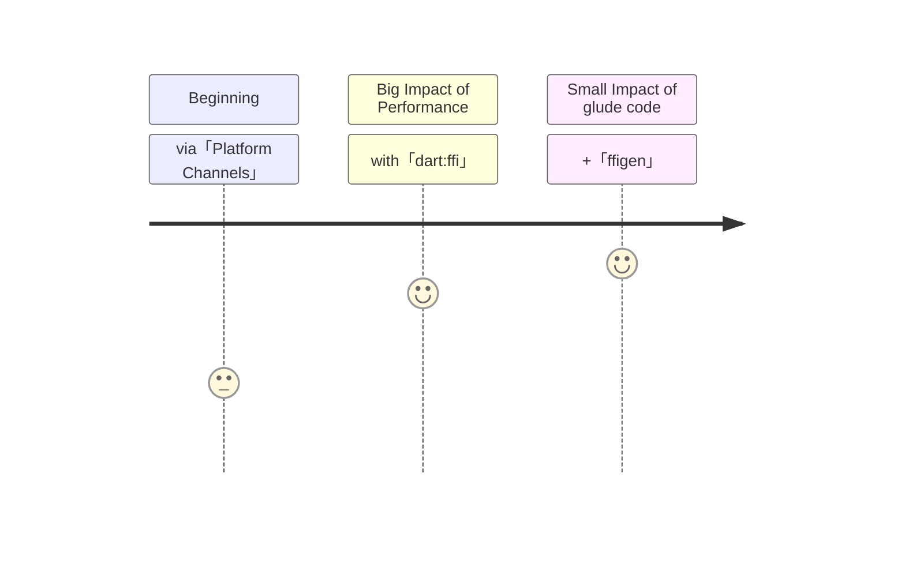

# calling <UniqueTechnicalTerm val="native C APIs"/>

---

<PageTitleHeader section="calling native C APIs" title="Use Case"/>

## Use Case

Often I want to use an existing C based library that is difficult to replace and is often highly optimized.  
A few examples include the use of [realm](https://github.com/realm/realm-core) and [opencv](https://opencv.org/).

---
layout: two-cols
---
<!-- https://github.com/slidevjs/slidev/blob/main/packages/client/layouts/two-cols.vue -->

<PageTitleHeader section="calling native C APIs" title="Journey Overview"/>

## Journey Overview

<!-- https://mermaid-js.github.io/mermaid/#/./flowchart?id=entity-codes-to-escape-characters -->

::right::

 
 
 
 

    
[supplement]

    
<TechnicalTerm val="dart:ffi"/> Architecture Overview

    
     
    <a href="https://github.com/dart-lang/sdk/blob/master/samples/ffi/sqlite/docs/sqlite-tutorial.md#architecture-overview">ref: "dart-lang/sdk | dart:ffi SQLite mini tutorial | Architecture Overview"</a>

---

<PageTitleHeader section="calling native C APIs" title="Issues"/>

## Issues at Beginning

I had to use <a href="https://docs.flutter.dev/development/platform-integration/platform-channels" target="_blank"><TechnicalTerm val="Platform Channels"/></a> to call <UniqueTechnicalTerm val="native C APIs"/>.  
There are two issues.
<!-- [Dart VM FFI Vision written by Google dart-lang Team Engineer](https://gist.github.com/mraleph/2582b57737711da40262fad71215d62e) -->

● A lot of glue code  
I have to write a lot of glue code in both Dart and a respective platform language.

● Performance  
Not only there is an **overhead** to call <TechnicalTerm val="Platform Channels"/>, but **[Executing channel handlers on background threads](https://docs.flutter.dev/development/platform-integration/platform-channels#channels-and-platform-threading)** is not supported except for iOS and Android.  
Especially, If I want to call <UniqueTerm val="Expensive"/> <UniqueTechnicalTerm val="native C APIs"/> on macOS/Windows/Linux without UI lag, I would struggle to improve my performance.

---

<PageTitleHeader section="calling native C APIs" title="Impact"/>

## Impact by <TechnicalTerm val="dart:ffi"/>

I don't have to use <TechnicalTerm val="Platform Channels"/>, because I can use <TechnicalTerm val="dart:ffi"/> to call <UniqueTechnicalTerm val="native C APIs"/>.

● Amount of implementation  
I don't have to write a lot of glue code in respective platform language.

● Performance  
I can implement <UniqueTerm val="Expensive"/> logic with background thread.  
(With <TechnicalTerm val="dart:ffi"/>, I can spawn isolate.)
