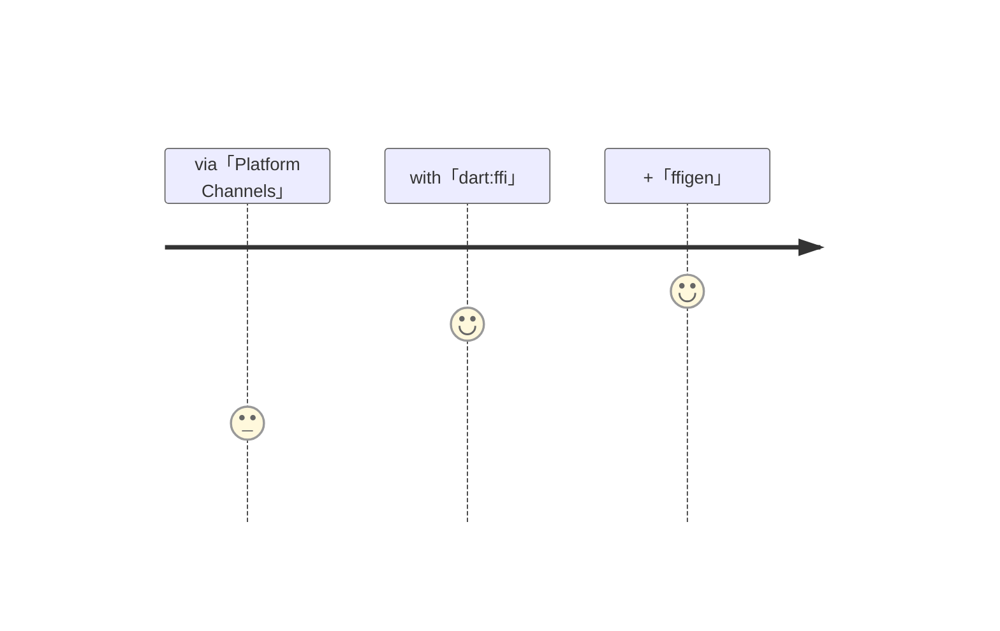

# calling <UniqueTechnicalTerm val="native C APIs"/>

---

<PageTitleHeader section="calling native C APIs" title="Use Case"/>

## Use Case

Often I want to use an existing C based library that is difficult to replace and is often highly optimized.  
A few examples include the use of [realm](https://github.com/realm/realm-core) and [opencv](https://opencv.org/).

---

<PageTitleHeader section="calling native C APIs" title="Journey Overview"/>

## Journey Overview

<!-- https://mermaid-js.github.io/mermaid/#/./flowchart?id=entity-codes-to-escape-characters -->

---

<PageTitleHeader section="calling native C APIs" title="Issues"/>

## Issues

I had to call <UniqueTechnicalTerm val="native C APIs"/> via <a href="https://docs.flutter.dev/development/platform-integration/platform-channels" target="_blank"><TechnicalTerm val="Platform Channels"/></a>.  
As stated by [Dart VM FFI Vision written by Google dart-lang Team Engineer](https://gist.github.com/mraleph/2582b57737711da40262fad71215d62e), there are two issues.

● Amount of implementation  
I have to write a lot of glue code in both Dart and a respective platform language.

● Performance  
Not only there is an **overhead** to <TechnicalTerm val="Platform Channels"/>, but **[background thread support](https://docs.flutter.dev/development/platform-integration/platform-channels#channels-and-platform-threading)** is not available except for iOS and Android.  
Especially, If I want to use <UniqueTechnicalTerm val="native C APIs"/> on macOS/Windows/Linux with background thread to implement <UniqueTerm val="Expensive"/> logic, I would struggle to improve my performance.

---

<PageTitleHeader section="calling native C APIs" title="Impact"/>

## Impact by <TechnicalTerm val="dart:ffi"/>

● Amount of implementation  
I don't have to write a lot of glue code in respective platform language.

● Performance
