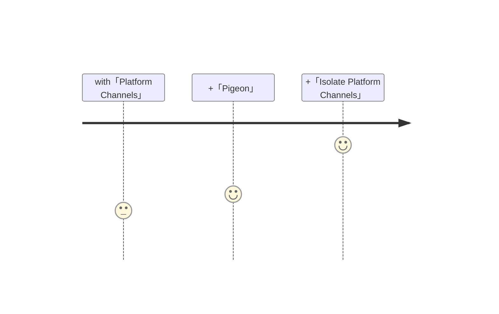

# calling <UniqueTechnicalTerm val="platform-specific APIs"/>

---

<PageTitleHeader section="calling platform-specific APIs" title="Use Case"/>

## Use Case

As the term implies, it is used to call <UniqueTechnicalTerm val="platform-specific APIs"/>.  
A few examples include the use of [security-scoped bookmarks](https://pub.dev/packages/macos_secure_bookmarks) and [file_selector](https://pub.dev/packages/file_selector).

    

        [supplement] <TechnicalTerm val="Platform Channels"/> Architectural overview
        (<a href="https://docs.flutter.dev/development/platform-integration/platform-channels#architecture">ref: "Flutter docs"</a>)
    

---

<PageTitleHeader section="calling platform-specific APIs" title="Journey Overview"/>

## Journey Overview

<!-- https://docs.flutter.dev/development/platform-integration/platform-channels#pigeon -->

---

<PageTitleHeader section="calling platform-specific APIs" title="Issues"/>

## Issues

It's heavy to implement <UniqueTerm val="Expensive"/> logic to call <UniqueTechnicalTerm val="platform-specific APIs"/>.  
It's because <TechnicalTerm val="Platform Channels"/> can't be used from all isolates and occupy UI thread.

---

<PageTitleHeader section="calling platform-specific APIs" title="Impact"/>

## (Future) Impact by <TechnicalTerm val="Isolate Platform Channels"/>

TODO: aaa
