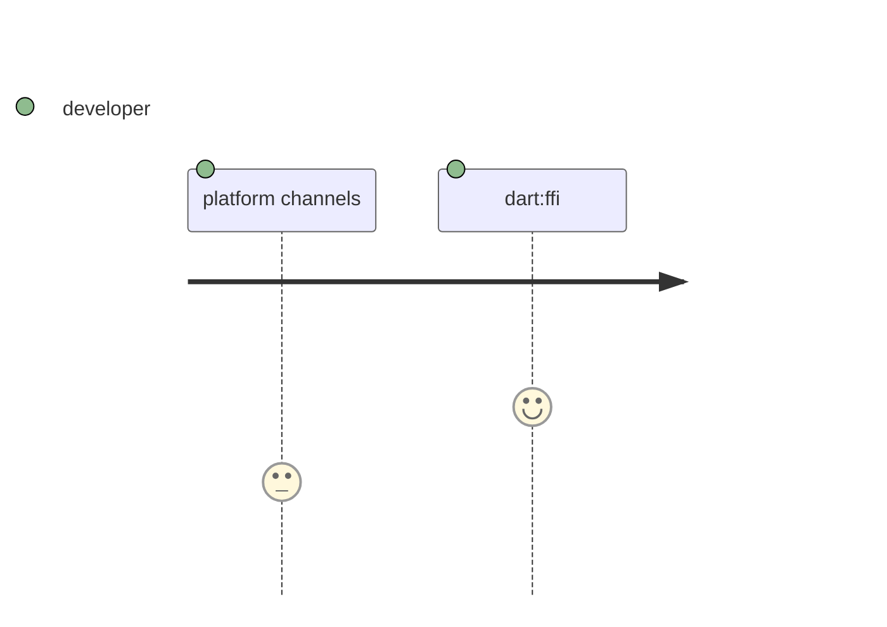
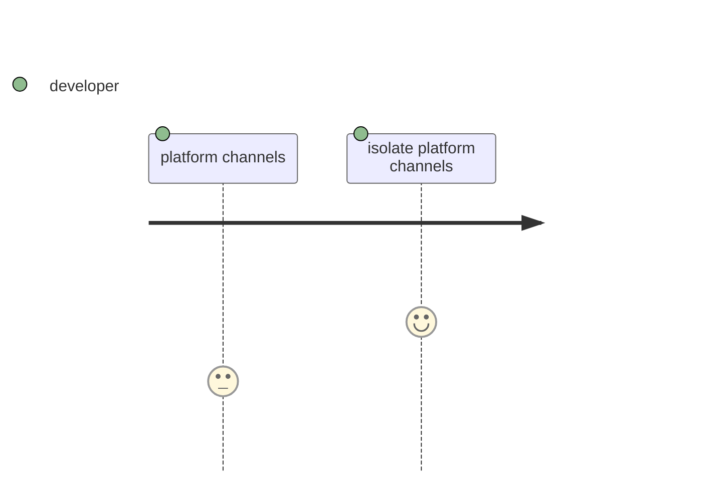

<!-- https://github.com/slidevjs/slidev/blob/main/packages/client/layouts/two-cols.vue -->

<PageTitleHeader section="Introduction" title="Journey Overview"/>

## Journey: <Term val="native C APIs"/>
 

<!-- https://mermaid-js.github.io/mermaid/#/./flowchart?id=entity-codes-to-escape-characters -->

::right::

## Journey: <Term val="platform-specific APIs"/>

