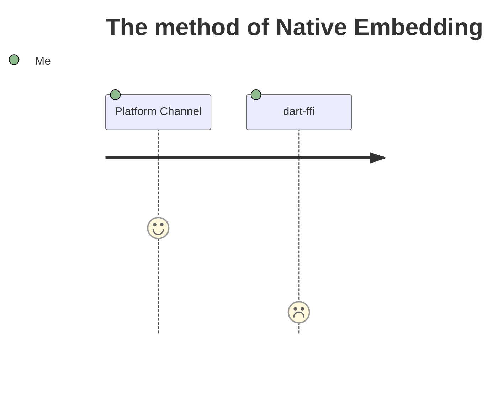

# Flutter Expensive Native Embedding Journey

at [FlutterKaigi 2022](https://flutterkaigi.jp/2022/)

<!-- <div class="pt-12">
  <span @click="$slidev.nav.next" class="px-2 py-1 rounded cursor-pointer" hover="bg-white bg-opacity-10">
    Press Space for next page <carbon:arrow-right class="inline"/>
  </span>
</div> -->

<div class="abs-br m-6 flex gap-2">
  <a href="https://github.com/sensuikan1973/flutter_expensive_native_embedding_journey/" target="_blank" alt="GitHub"
    class="text-xl icon-btn opacity-50 !border-none !hover:text-black">
    <carbon-logo-github />
  </a>
  <a href="https://sensuikan1973.github.io/flutter_expensive_native_embedding_journey//flutter_expensive_native_embedding_journey/.pdf" target="_blank"
    class="text-xl icon-btn opacity-50 !border-none !hover:text-black">
    <carbon-download />
  </a>
</div>

<!--
日本語版タイトル「Flutter における高価なネイティブ処理の実装。その歴史と将来」について補足する。
https://sli.dev/guide/syntax.html#notes
-->

---

## What is **_Expensive_** here ?

Operations require a lot of CPU, Memory and Running Time.  
e.g. Connection to remote server, Huge Numerical computation, ...

## What is **_Native_** here ?

- ① C APIS on Android/iOS/macOS
- ② platform-specific APIs <br/> (Kotlin/Java on Android, Swift/Objective-C on iOS, C++ on Windows, Objective-C on macOS, C on Linux)

<!--
https://docs.flutter.dev/development/platform-integration/platform-channels

https://docs.flutter.dev/development/platform-integration/android/c-interop
https://docs.flutter.dev/development/platform-integration/ios/c-interop
https://docs.flutter.dev/development/platform-integration/macos/c-interop
-->

---

# Journey




---

# Code

Use code snippets and get the highlighting directly![^1]

```ts {all|2|1-6|9|all}
interface User {
  id: number;
  firstName: string;
  lastName: string;
  role: string;
}

function updateUser(id: number, update: User) {
  const user = getUser(id);
  const newUser = { ...user, ...update };
  saveUser(id, newUser);
}
```

<arrow v-click="3" x1="400" y1="420" x2="230" y2="330" color="#564" width="3" arrowSize="1" />

[^1]: [Learn More](https://sli.dev/guide/syntax.html#line-highlighting)

<style>
.footnotes-sep {
  @apply mt-20 opacity-10;
}
.footnotes {
  @apply text-sm opacity-75;
}
.footnote-backref {
  display: none;
}
</style>
